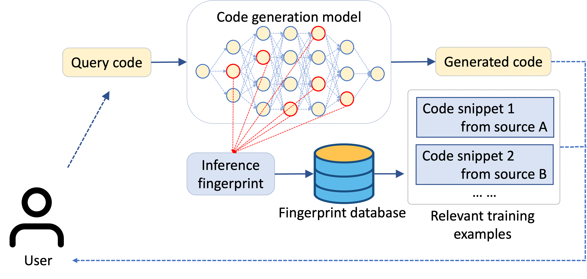

# WhyGen based on CodeGPT code generator (next line task)

Here we describe how to implement the CodeGPT model with training, inference and evaluation, and WhyGen to extract the neurons of the specified layer.

An example of relevant training examples returned by WhyGen.


## Task Definition

CodeGPT completes the next line given on the previous context, and the model evaluates them by exact matching and edit similarity. In the process of generating the next line, WhyGen first records the neurons of the self-attention layer or the feed forward layer for test each data for statistical computation.

## py150 dataset

We use py150 dataset from Raychev's OOPSLA 2016 paper [Probabilistic Model for Code with Decision Trees](https://files.sri.inf.ethz.ch/website/papers/oopsla16-dt.pdf).

To download and preprocess the dataset, navigate to `dataset/py150` directory, and run
```shell
bash download_and_extract.sh
python preprocess.py --base_dir=py150_files --output_dir=token_completion
```
### Data Statistics

Data statistics of py150 dataset are shown in the below table, note that there doesn't exist dev set in the origin py150 dataset, we select 5,000 files in the original train set as dev set.

| Data Split  |   #Files    |   #Tokens   |
| ----------- | :---------: | :---------: |
|    Train    |    95,000   |    72.1M    |
|     Dev     |    5,000    |     4.4M    |
|    Test     |    50,000   |    37.3M    |


### Data Preprocessing

- Tokenization is applied. 
- We normalize uncommon literals for better user experience. Developers sometimes leave their names, IP address, phone numbers in their codes, and we don't encourage models to focus on these string or numeric literals. So we normalized these literals by some special tokens. Considering that frequently used literals may contain useful information, e.g. "\_\_main\_\_" or "utf-8", we preserve the 200 most frequent string and 30 most frequent numeric literals. These literals will be normalized by tokens in `"<STR_LIT:utf-8>"` format, while uncommon literals are replaced by `<STR_LIT>` or `<NUM_LIT>`. 
- We add `<s>` and `</s>` to indicate the start and the end of one piece of code. 
- `<EOL>` is added in python corpus to mark the ending of a line since in python there is no `;` or `}` to mark the ending of a statement like in java.

### py150 line completion test set for inference

We use the first 1/2 part of each data as input according to the number of rows of data, and the next line as ground truth. Models are expected to generating the code sequence in the latter part until the first $<EOL>$ token (excluding $<EOL>$).

Test set is already at `dataset/py150/line_completion/inference/test.json`.


### py150 line completion test set for record neuron activations

We use the input of inference as the input of record neuron activations.

Test set is already at `dataset/py150/line_completion/record/test.json`.

#### Data Format

Data is saved in json lines format files. Each line is a json object. To be consistent with token level code completion, codes have been tokenized. Here is an example of one line:
```
{
  "rec_id": "2012", 
  "recitation_code": "@ pl announce ( ' ' )", 
  "input_code_id": 2012, 
  "input": "<s> from spockbot . plugins import default_plugins <EOL> from spockbot . plugins . base import get_settings , pl_announce <EOL> class PloaderFetch ( object ) : <EOL> def __init__ ( self , plugins , plugin_settings ) : <EOL> self . plugins = plugins <EOL> self . plugin_settings = plugin_settings <EOL> def get_plugins ( self ) : <EOL> return self . plugins <EOL> def get_plugin_settings ( self , plugin ) : <EOL> return self . plugin_settings . get ( plugin , { } ) <EOL> @ pl_announce ( '<STR_LIT>' ) <EOL>"
}
```

## Evaluator

We provide a script to evaluate predictions for this task, and report exact match score and edit similarity. You can run the script like this:

```bash
python evaluator/evaluator.py -a=evaluator/answers.json -p=evaluator/predictions.txt
```

The outputs are:
| Model                                                 |     EM     |  Edit similarity  |
| ----------------------------------------------------- | :--------: | :---------------: |
| CodeGPT-adapted                                       |  **42.37** |     **71.59**     |


**Note** that when evaluating, the normalized literals will be converted to the original format, e.g. <NUM_LIT:1> => 1, '<STR_LIT>' => ''

### Input Format

A legal prediction file is expected to be a txt format file. It should have the same number of lines as answer file. Each line is the model prediction for the corresponding input in answer file. For example, one line in the answer file is:
```
{
  "input": "<s> from __future__ import absolute_import , division , print_function <EOL> from . _ithreads import AlreadyQuit <EOL> class Quit ( object ) : <EOL>",
  "gt": "def __init__ ( self ) :"
}
```

And the corresponding line in your prediction file is:
```
def __init__ ( self ) :
```


## Pipeline

We used the CodeGPT-small-py-adaptedGPT2 model on the Hugging face website (this model comes from [CodeXGLUE](https://github.com/microsoft/CodeXGLUE), a work of Microsoft Research Asia), and then we used the py150 dataset for fine-tuning to fit our work.

### Dependency

- python 3.6 or 3.7
- torch==1.6.0
- transformers>=2.5.0 and < 4.0.0
- fuzzywuzzy

### Fine-tune
To fine-tune CodeGPT on py150 dataset for code completion in multi-GPU on a single machine, navigate to `code` directory, run:

```shell
LANG=python
DATADIR=../dataset/py150/token_completion
LITFILE=../dataset/py150/literals.json
OUTPUTDIR=../save/py150
PRETRAINDIR=microsoft/CodeGPT-small-py
LOGFILE=completion_py150.log
PER_NODE_GPU=YOUR_GPU_NUM       # modify YOUR_GPU_NUM

python -m torch.distributed.launch --nproc_per_node=$PER_NODE_GPU run_lm.py \
        --data_dir=$DATADIR \
        --lit_file=$LITFILE \
        --langs=$LANG \
        --output_dir=$OUTPUTDIR \
        --pretrain_dir=$PRETRAINDIR \
        --log_file=$LOGFILE \
        --model_type=gpt2 \
        --block_size=1024 \
        --do_train \
        --gpu_per_node $PER_NODE_GPU \
        --learning_rate=8e-5 \
        --weight_decay=0.01 \
        --evaluate_during_training \
        --per_gpu_train_batch_size=2 \
        --per_gpu_eval_batch_size=4 \
        --gradient_accumulation_steps=4 \
        --num_train_epochs=5 \
        --logging_steps=100 \
        --save_steps=1000 \
        --seed=42 \
        --overwrite_output_dir \
        --not_pretrain
```

We stop at 50000 steps on py150 experiment, which takes 25 hours, and experiments run on 2 NVIDIA P100.

### Inference

It's recommanded to run inference on single GPU. The predictions will be saved at `$OUTPUTDIR/predictions_line.txt`

```shell
export CUDA_VISIBLE_DEVICES=0
LANG=python
DATADIR=../dataset/py150/line_completion
LITFILE=../dataset/py150/literals.json
OUTPUTDIR=../save/pythonCorpus
PRETRAINDIR=../save/javaCorpus/checkpoint
LOGFILE=completion_pythonCorpus_eval.log

python -u run_lm.py \
        --data_dir=$DATADIR \
        --lit_file=$LITFILE \
        --langs=$LANG \
        --output_dir=$OUTPUTDIR \
        --pretrain_dir=$PRETRAINDIR \
        --log_file=$LOGFILE \
        --model_type=gpt2 \
        --block_size=1024 \
        --eval_line \
        --logging_steps=100 \
        --seed=42 
```

It might take 45 minutes for inferencing on py150 dataset on a single NVIDIA P100.

### Record neuron activations

It's recommanded to run inference on single GPU. The predictions will be saved at Mongodb as `test_input_activations`.

```shell
export CUDA_VISIBLE_DEVICES=0
LANG=python
DATADIR=../dataset/py150/line_completion
LITFILE=/../dataset/py150/literals.json
OUTPUTDIR=../save/pythonCorpus
PRETRAINDIR=../save/javaCorpus/checkpoint
LOGFILE=completion_pythonCorpus_eval.log

python -u run_lm.py \
        --data_dir=$DATADIR \
        --lit_file=$LITFILE \
        --langs=$LANG \
        --output_dir=$OUTPUTDIR \
        --pretrain_dir=$PRETRAINDIR \
        --log_file=$LOGFILE \
        --model_type=gpt2 \
        --block_size=1024 \
        --eval_line \
        --logging_steps=100 \
        --seed=42
```

## WhyGen demo
The workflow of WhyGen to explain DNN-powered code generation by examples.


## Citation
If you find this repository useful in your research, please cite the following paper:
```
@inproceedings{WeixiangYan2022WhyGenEM,
  title={WhyGen: Explaining ML-powered Code Generation by Referring to Training Examples},
  author={Weixiang Yan and Yuanchun Li},
  year={2022}
}

```

## Contact
For questions, please feel free to reach out via email at yanweixiang@bupt.edu.cn.

